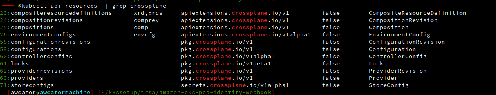

Installation
```renderscript
pacman -S helm
helm repo add crossplane-stable https://charts.crossplane.io/stable
helm repo update

helm install crossplane crossplane-stable/crossplane --dry-run --debug --namespace crossplane-system --create-namespace
helm install crossplane crossplane-stable/crossplane --namespace crossplane-system --create-namespace
sleep 10
k get pods -n crossplane-system
kubectl api-resources  | grep crossplane
```

```renderscript
cat <<EOF | kubectl apply -f -
apiVersion: pkg.crossplane.io/v1
kind: Provider
metadata:
  name: provider-aws-s3
spec:
  package: xpkg.upbound.io/upbound/provider-aws-s3:v0.37.0
EOF

kubectl get providers
sleep 30

cat <<EOF | tee aws_creds.txt
[default]
aws_access_key_id = <inser here>
aws_secret_access_key = <inser here>
EOF

kubectl create secret generic aws-secret -n crossplane-system --from-file=creds=./aws_creds.txt
```
Create the provider config
```renderscript
cat <<EOF | kubectl apply -f -
apiVersion: aws.upbound.io/v1beta1
kind: ProviderConfig
metadata:
  name: default
spec:
  credentials:
    source: Secret
    secretRef:
      namespace: crossplane-system
      name: aws-secret
      key: creds
EOF
```
first simple test
```renderscript
bucket=$(echo "crossplane-bucket-"$(head -n 4096 /dev/urandom | openssl sha1 | tail -c 10))
cat <<EOF | kubectl apply -f -
apiVersion: s3.aws.upbound.io/v1beta1
kind: Bucket
metadata:
  name: $bucket
spec:
  forProvider:
    region: us-east-2
  providerConfigRef:
    name: default
EOF

sleep 50
kubectl get buckets
kubectl get managed
kubectl delete bucket $bucket
```

```renderscript
k get crds
k get providers 
k get ProviderConfig

k get xrds  #contains user created compostes (composite=custom)
kubectl get managed
kubectl get compositions
kubectl get envcfg
kubectl get storeconfigs
```

cat <<EOF | kubectl apply -f -
apiVersion: database.example.com/v1alpha1
kind: NoSQLClaim
metadata:
name: my-nosql-database
namespace: crossplane-test
spec:
location: "US"
EOF


# refernces
https://docs.crossplane.io/latest/getting-started/provider-aws-part-2/


AWS.txt---->kuberneteSecrets
                ----------------> CrossPlaneProviderConfig-------------> CrossPlaneProvders

Claim----->XRD nosql--->compositions--->composite--->managed resorces